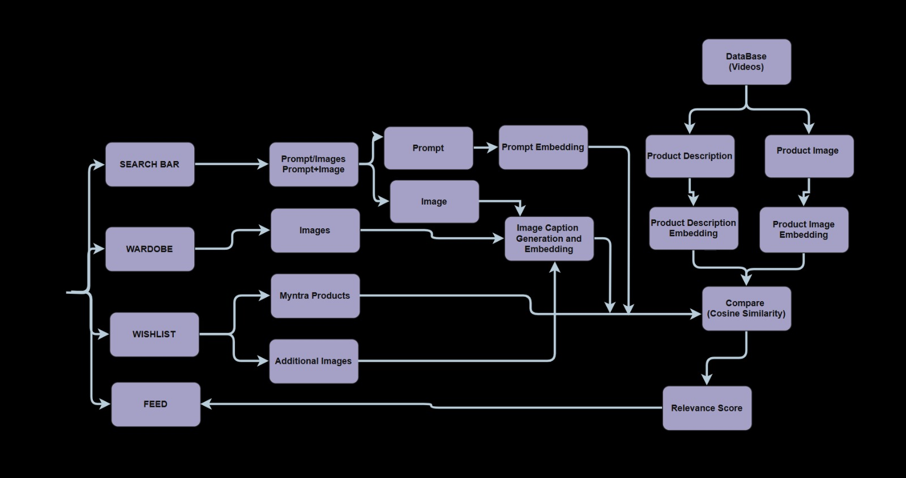

# Myntra Fashion Intelligence System - HackerRamp WeForShe 2025

## 🎯 Theme & Problem Statement

### Themes Addressed
- **Primary**: Theme 2 - The GenZ Way of Shopping
- **Secondary**: Theme 1 - The Hyper-Personalization

### Problem Statement
Gen Z consumers face significant challenges in fashion discovery due to:
- Impersonal and generic recommendations that don't align with personal style
- Difficulty in finding products that match their specific "vibes"
- Limited ability to find items complementing their existing wardrobe
- Traditional search methods that rely only on basic keywords or single images
- Fragmented shopping experience leading to reduced engagement

### Core Problems Identified
1. **Limited Search Capabilities**
   - Separate image and text-based search without integration
   - Lack of combined multimodal search functionality

2. **Non-Personalized Video Feed**
   - Random content appearance in MyGlamCan
   - Missing relevance to user preferences

3. **Missing Intelligence Layer**
   - Lack of exclusion/pairing logic
   - Absent color combination intelligence
   - No wardrobe-aware recommendations

## 💡 Our Solution
We've developed an advanced, personalized, vibe-based fashion discovery system that revolutionizes user engagement through context-aware personalization tailored for GenZ audiences. The system leverages AI-powered generative image understanding using BLIP(Salesfoce) and multi-modal search capabilities CLIP(GPT) to provide intelligent fashion recommendations.

### Key Solution Components
1. **Multimodal Fashion Intelligent Discovery Engine**
   - Combined text prompts, uploaded images, and wardrobe context in a single search
   - Natural language processing for price constraints ("under ₹1000")
   - GenZ slang and fashion terminology support ("aesthetic fits", "drip", "vibe")

2. **Wardrobe/Wishlist-Aware Fashion Intelligence**
   - Three-mode feed: Normal, Wardrobe-Similar(Haves), Wishlist-Similar(Have Nots)
   - Custom image upload capability for wishlist
   - Real-time relevance scoring system

3. **Advanced Fashion Intelligence**
   - Complementary Item Mapping for complete looks
   - AI-powered Color Coordination
   - Smart exclusion and pairing logic

## 🎨 Technical Architecture
1. **AI-Driven Style Understanding**
   - Utilizes CLIP model for advanced image-text matching
   - BLIP model for detailed fashion attribute extraction
   - Smart color coordination system

2. **Contextual Shopping Experience**
   - Wardrobe-aware recommendations
   - Style compatibility scoring
   - Occasion-based filtering

3. **Natural Language Processing**
   - Understanding of GenZ fashion terminology
   - Intelligent fashion intent recognition
   - Fuzzy matching for better search results

## 🌟 Core Features

### 1. Intelligent Search System
- Combined image and text-based search
- Price detection and filtering
- Smart fashion intent recognition
- Support for GenZ fashion terminology
- Fuzzy matching and typo correction

### 2. Smart Wardrobe Management
- Personal wardrobe organization
- Intelligent wardrobe search with exclusion/pairing logic
- Color coordination recommendations
- Complementary item suggestions (e.g., shirts→pants)
- Fashion reasoning (e.g., "different colors than wardrobe")

### 3. Advanced Wishlist System
- Product wishlist management
- Exact product matching
- Custom photo uploads


### 4. AI-Powered Features
- CLIP model for text embeddings
- BLIP model for image captioning
- Intelligent fashion attribute extraction
- Gender and occasion-based filtering
- Smart relevance scoring

## 🛠️ Technical Architecture

### System Overview
This architecture implements an advanced embedding search space with multiple components working simultaneousy:



#### Embedding Search Space Flow
1. **Database (Videos)**
   - Stores product videos with metadata
   - Contains rich product information
   - Maintains hashtags and attributes

2. **Search Processing**
   - **Search Bar**: Handles both text and image inputs
   - **Prompt Processing**: Extracts fashion intent and constraints
   - **Image Processing**: Analyzes uploaded images for search

3. **AI Model Pipeline**
   - **Prompt Embedding**: Converts text to vector space using CLIP
   - **Image Caption Generation**: BLIP model for image understanding
   - **Product Description Embedding**: Generates product vectors
   - **Product Image Embedding**: Creates image feature vectors

4. **Context Integration**
   - **Wardrobe Context**: Personal closet analysis
   - **Wishlist Integration**: Desired items consideration
   - **Myntra Products**: Product catalog integration

5. **Intelligent Matching**
   - **Comparison Engine**: Cosine similarity computation
   - **Additional Images**: Supplementary visual context
   - **Relevance Scoring**: Multi-factor ranking system

### Frontend Layer
- **Framework**: React with TailwindCSS
- **Key Components**:
  - Video Feed Page: TikTok-style shoppable video feed
  - Smart Search Bar: Multimodal search support
  - Wardrobe Page: Personal wardrobe management
  - Wishlist Page: Product and custom image management
- **Session Handling**: Persistent sessions using credentials-included fetch requests

### Backend Layer
- **Core Framework**: Flask with comprehensive middleware
  - Flask-Session for user state management
  - Flask-CORS for secure cross-origin requests
  - Custom session persistence layer

### AI/ML Pipeline
1. **CLIP (ViT-B/32)**
   - Generates embeddings for text & images
   - Enables multi-modal search capabilities
   - Powers similarity matching

2. **BLIP Image Captioning**
   - Automated caption generation
   - Enhanced image understanding
   - Wardrobe/wishlist item analysis

### Data Processing Flow
1. **Input Processing**
   - Text prompt analysis
   - Image preprocessing
   - Wardrobe context integration

2. **Embedding Generation**
   - Product description embedding
   - Image feature embedding
   - Context vector creation

3. **Intelligent Matching**
   - Cosine similarity computation
   - Fuzzy text matching
   - Context-aware scoring

### Data Storage Layer
- **Video Index**: JSON-based product metadata
- **Session Storage**: Wardrobe & wishlist state
- **Media Storage**: Product and user media

## 🚀 Getting Started

### Prerequisites
- Python 3.x
- Node.js
- npm/yarn

### Backend Setup
1. Navigate to the backend directory:
```bash
cd backend
```

2. Install Python dependencies:
```bash
pip install flask flask-cors flask-session pillow torch sentence-transformers transformers numpy
```

3. Start the Flask server:
```bash
python app.py
```

### Frontend Setup
1. Navigate to the frontend directory:
```bash
cd frontend
```

2. Install dependencies:
```bash
npm install
```

3. Start the development server:
```bash
npm run dev
```

## � Impact

### 1. Frictionless Discovery
- Faster product discovery reducing endless scrolling
- Lower drop-off rates through intelligent recommendations
- Improved conversion through personalized suggestions

### 2. Differentiated Experience 
- Unique AI-powered, wardrobe-aware shopping feed
- Novel approach attracting younger audience
- Enhanced engagement through personalization

### 3. Deep Personalization 
- Trust building through style understanding
- Improved repeat purchase rates
- Enhanced customer lifetime value

### 4. Data Advantage 
- Rich data collection through wardrobe/wishlist uploads
- Deep understanding of customer preferences
- Continuous improvement in recommendation accuracy

## 📝 API Documentation

### Core Endpoints
- `POST /api/search` - Intelligent search with combined features
- `GET/POST/DELETE /api/wardrobe` - Wardrobe management
- `GET/POST/DELETE /api/wishlist` - Wishlist management
- `GET /api/feed` - Get filtered feed (normal/wardrobe/wishlist)

### Media Endpoints
- `GET /videos/<filename>` - Video serving
- `GET /thumbnails/<filename>` - Image thumbnail serving
- `GET /wardrobe_photos/<filename>` - Wardrobe image serving
- `GET /wishlist_photos/<filename>` - Wishlist image serving
- `GET /wardrobe_photos/<filename>` - Wardrobe photo serving
- `GET /wishlist_photos/<filename>` - Wishlist photo serving


## 👥 Team & Acknowledgements
### Team Members
- [Team Member: Ankita Tripathi, Sakshi Mishra, Kiran Tikaraya]
- Project created for Myntra Hackerramp WeForShe 2025


## 📄 License & Recognition
This project was developed as part of Myntra Hackerramp WeForShe 2025.
All rights reserved. Copyright © 2025
